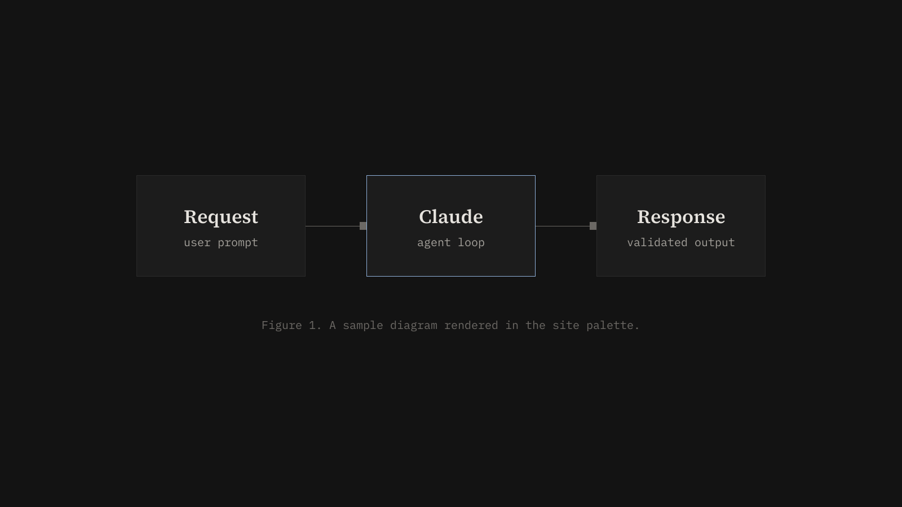
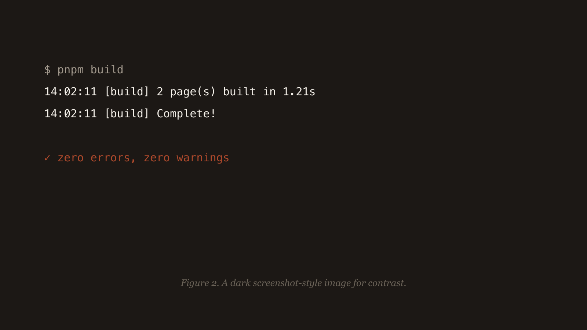

import Callout from '../../components/Callout.astro'

This is a placeholder post so you can judge the typography and rhythm of the
blog before writing real content. It exercises everything the pipeline
supports. Delete it (or flip `draft: false`) when the first real post is ready.

## Plain prose

Body text is set in Source Serif 4 at a comfortable measure, with IBM Plex Mono for dates, labels, and code. Paragraphs get
generous line height and a clear vertical rhythm. Inline elements like
[links](https://kolesnik.io), `inline code`, and **bold text** should all sit
quietly inside the paragraph without shouting.

## Images

Images are optimized by Astro at build time (sharp, responsive `srcset`,
lazy-loading). A diagram rendered in the site palette:



And a dark, screenshot-style image for contrast:



## Code

```ts
import { getCollection } from 'astro:content'

const posts = (await getCollection('blog', ({ data }) => !data.draft)).sort(
  (a, b) => b.data.pubDate.valueOf() - a.data.pubDate.valueOf(),
)
```

## MDX components

Because this file is `.mdx`, it can import Astro components:

<Callout title="Why MDX">
  Plain prose stays markdown, but anything interactive or repeated - callouts,
  embeds, figures - becomes a component instead of copy-pasted HTML.
</Callout>

## Lists and structure

A few things worth checking at this stage:

- Heading hierarchy and spacing between sections
- List markers, indentation, and paragraph gaps inside lists
- How much a post breathes at the 65-character measure

1. Ordered lists render with the same rhythm
2. Numbers align with the text block
3. Nothing decorative, everything readable

> Blockquotes are set off with a hairline rule and muted ink - useful for
> pull-quotes or citing a source without breaking the page's tone.

That's the whole surface area. Real posts can use any subset of this.
